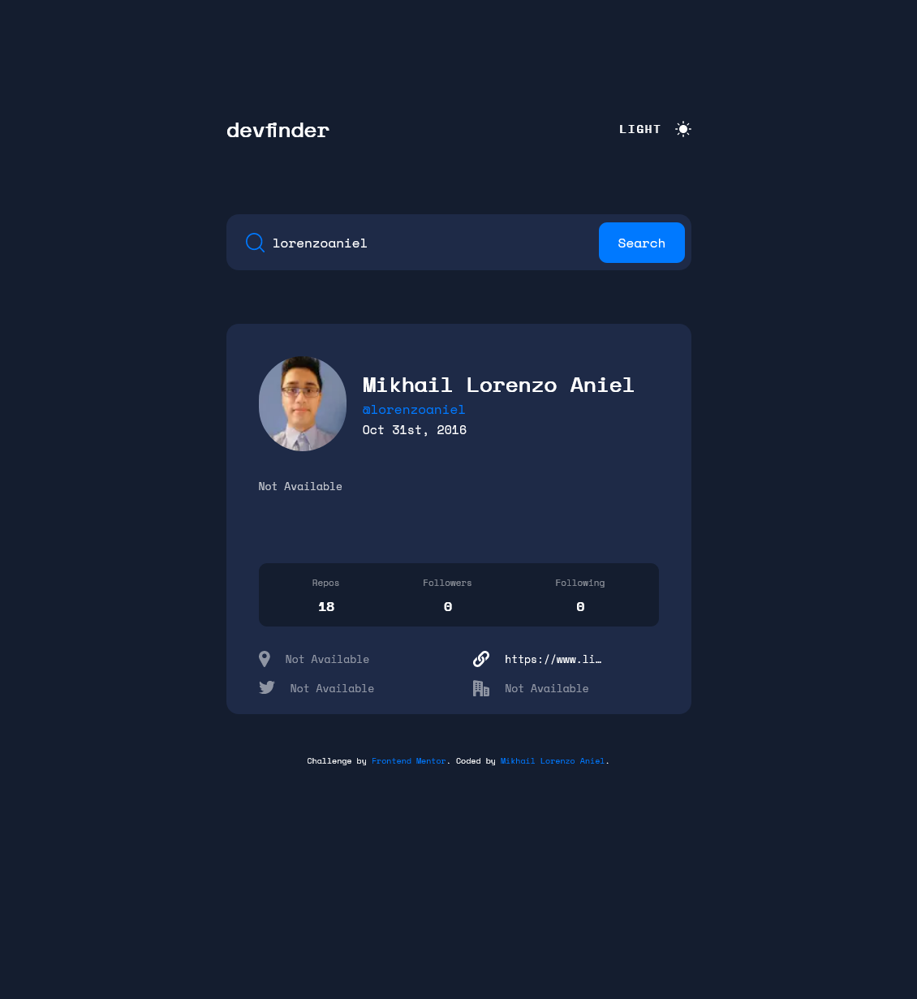

# Frontend Mentor - GitHub user search app solution

This is a solution to the [GitHub user search app challenge on Frontend Mentor](https://www.frontendmentor.io/challenges/github-user-search-app-Q09YOgaH6). Frontend Mentor challenges help you improve your coding skills by building realistic projects.

## Table of contents

- [Overview](#overview)
  - [The challenge](#the-challenge)
  - [Screenshot](#screenshot)
  - [Links](#links)
- [My process](#my-process)
  - [Built with](#built-with)
- [Author](#author)

## Overview

### The challenge

Users should be able to:

- View the optimal layout for the interface depending on their device's screen size
- See hover and focus states for all interactive elements on the page

### Screenshot

### Links

- Solution URL: [Results Summary Component solution](https://www.frontendmentor.io/solutions/results-summary-component-tailwindcssreactjstypescriptvite-_0B21X_Lva)
- Live Site URL: [Results Summary Component livesite](https://lorenzoaniel.github.io/results-summary-component/)

## My process

### Built with

- Semantic HTML5 markup
- Flexbox
- CSS Grid
- Mobile-first workflow
- [React](https://reactjs.org/) - JS library
- [NEXTJS13](https://nextjs.org/) - React Framework
- [TailWindCSS](https://tailwindcss.com/) - For styles/animations

## Author

- Website - [Mikhail Lorenzo Aniel](https://www.mikhaillorenzoaniel.com/)
- Frontend Mentor - [@lorenzoaniel](https://www.frontendmentor.io/profile/lorenzoaniel)
- LinkedIn - [Mikhail Lorenzo Aniel](https://www.linkedin.com/in/mikhail-lorenzo-aniel-283022127/)
